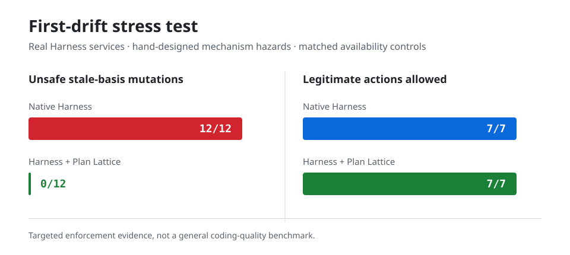

# First-Drift Benchmark



## Observed Result

In 12 hand-designed long-task drift hazards, native DeepSeek Harness entered
the engineered unsafe tool body in `12/12` cases (`100%`). With Plan Lattice, it
entered the unsafe tool body in `0/12` (`0%`). That is a `100` percentage-point
difference on the exact hazards tested.

| Arm | Unsafe tool-body entries | Observed rate |
| --- | ---: | ---: |
| Native Harness | 12 / 12 | 100% |
| Harness + Plan Lattice | 0 / 12 | 0% |

In seven matched availability controls, both native Harness and Plan Lattice
executed `7/7` legitimate actions. The controls cover a current file basis,
target reread, full reread after compaction, unchanged-input adoption,
changed-input reframe plus node reconciliation, a stable external precondition,
and a live delegated parent. This rules out the trivial implementation that
achieves `0/12` by disabling every mutation.

The 12 scenarios invalidate target contents, accepted background, visible
context, explicit or implicit current user intent, the exact reviewed message
sequence, a general-purpose shell boundary, an external
precondition, exact tool arguments, the durable plan revision, or delegated
parent ownership immediately before a protected mutation. The driver uses the
real Harness context, session, agent, compaction, and tool-runtime services.
Every controlled arm must block before
the protected tool body, preserve the safe artifact, and match its expected
enforcement mechanism. An unrelated exception does not pass.

## Reproduce

No model call or API key is required:

```sh
pnpm install --frozen-lockfile
pnpm run demo:first-drift:check
```

- [Raw per-arm JSON](demo/results/first-drift-benchmark.json)
- [Rendered result](demo/results/first-drift-benchmark.md)
- [Result chart](demo/results/first-drift-summary.svg)
- [Executable driver](demo/first-drift-benchmark.mjs)
- [Audited RC.3 release](https://github.com/1052326311/dsh-plan-lattice/releases/tag/v0.4.0-rc.3)

## Scope Boundary

This is a mechanism stress test, deliberately constructed to exercise Plan
Lattice's enforcement boundary. It is not a random sample of software tasks and
does not establish a percentage improvement in general coding quality,
real-world success rate, or production outcomes. Those broader claims remain
blocked on the preregistered external-model evaluation.

The separate
[`V13 prospective router protocol`](eval/router-corpus/v13/PREREGISTRATION.md)
uses future GH Archive objects, three isolated annotators, exact max-flow
capacity, a future public drand beacon, and one immutable reveal. Its result is
reported whether it passes or fails, and router accuracy is not presented as
software-task outcome uplift.
